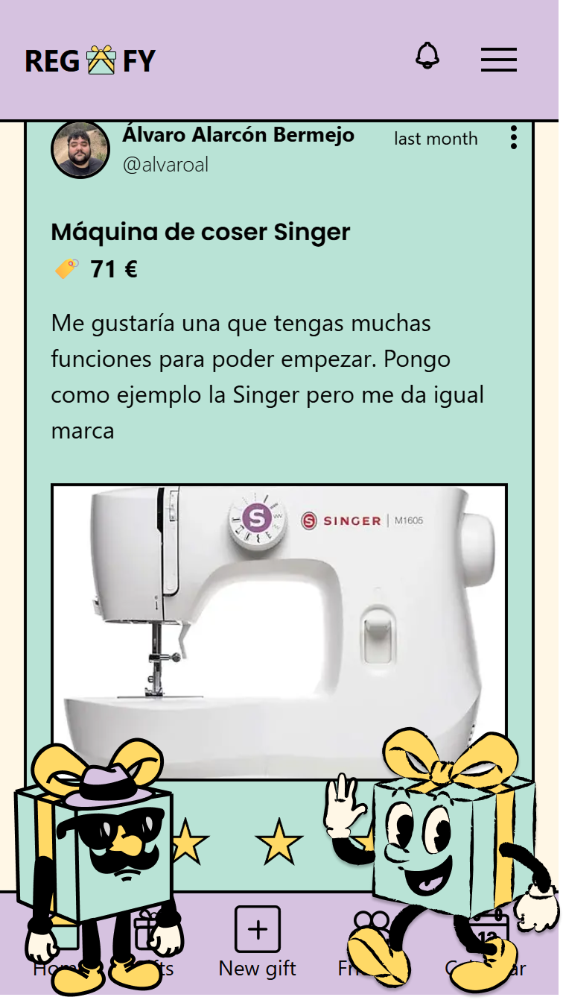
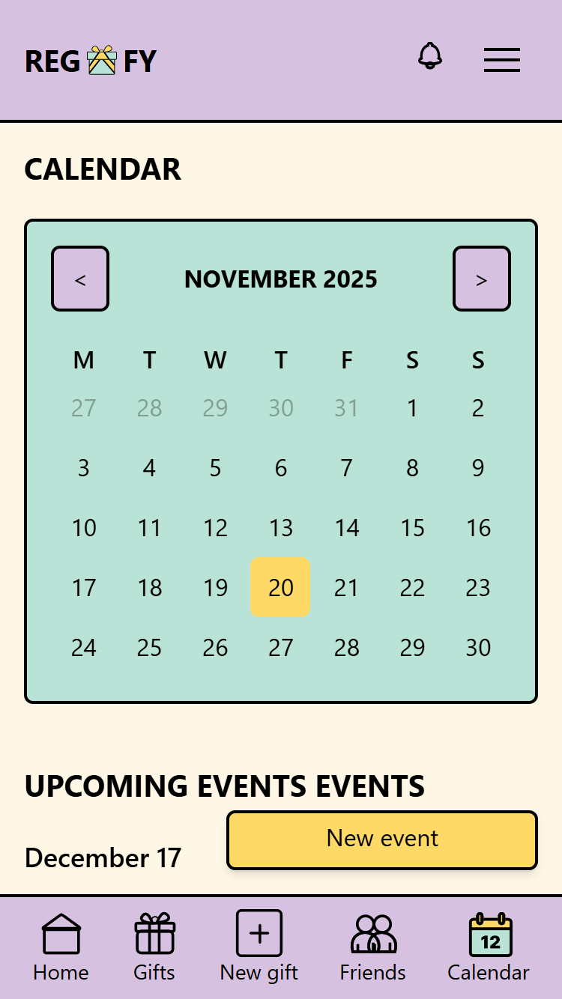
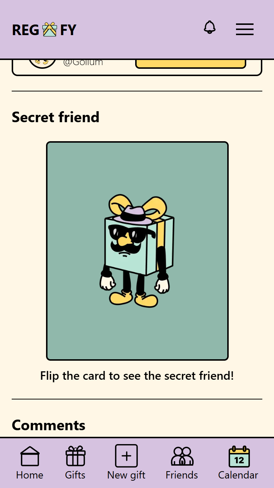

## 👋 Foreword

Hi, my name is Álvaro and I'm a web developer.

If you like what you see, please feel free to get in touch. I would be happy to show you a live demo and explain how everything works.

---

# Regafy 🎁

**Regafy** is a social network for gifts! Connect with friends, explore their wishlists, reserve gifts, ask questions, create events, organize secret gift exchanges, and much more.  

Built with **React**, **Next.js**, **Supabase**, **next-intl**, **Zod**, **React Hook Form**, and more, Regafy makes giving and sharing gifts fun, easy, and social.  

  

---

## 🚀 Features

- **Friends & Profiles**: Add friends and view their profiles.  
- **Gift Management**: Browse gifts, reserve items, and ask questions.  
- **Events & Exchanges**: Create events and organize secret gift exchanges.  
- **Real-time Updates**: Powered by Supabase for instant interactions.  
- **Forms & Validation**: Smooth forms with React Hook Form + Zod.  
- **Multi-language Support**: Built with next-intl for localization.  
- **Responsive Design**: Works on desktop, tablet, and mobile devices.  

---

## 🛠 Tech Stack

- **Frontend**: React, Next.js, Sass  
- **Backend / Database**: Supabase (PostgreSQL)  
- **Authentication**: Supabase Auth  
- **Form Validation**: React Hook Form + Zod  
- **Internationalization (i18n)**: next-intl  
- **Hosting**: Vercel / Netlify  

---

## 🎨 Showcase
Here are some screenshots.

  

  

---

## 📄 License

This project is licensed under the **MIT License**. See the [LICENSE](LICENSE) file for details.

